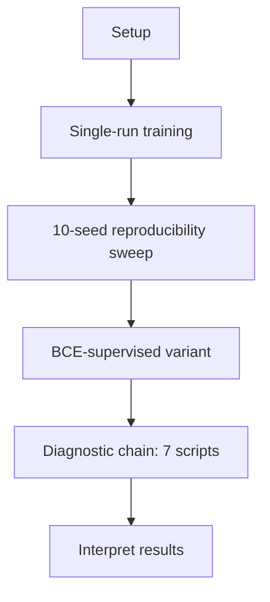

# LayerRoute: Adaptive Layer-Skipping with LoRA-Preserved Quality

Reproduction guide. Every step below includes our own reference numbers so you can check your run against ours at each stage.



---

## 0. Setup

```bash
python3 -m venv venv
source venv/bin/activate
pip install torch>=2.1.0 transformers==4.46.3 "datasets>=2.16.0" "accelerate>=0.26.0"
pip install scikit-learn scipy
```

Base model: Qwen2.5-0.5B-Instruct, 24 layers, hidden size 896. LoRA rank 8 on Q/K/V/O (1,081,344 params), 24 per-layer routers (21,528 params). 3,000 training steps, batch 4, grad-accum 4, lr 2e-4, cosine schedule.

**Our reference run time:** ~382s (6.4 min) per training run on an A100 40GB.

---

## 1. Single-Run Training

```bash
python main.py --mode train --max_steps 3000 --seed 2024 --output_dir ./checkpoints
python evaluate.py --ckpt checkpoints/best_adapters.pt --seed 2024 --out_dir checkpoints/paper_results
cat checkpoints/paper_results/paper_summary.csv
```

**Our result (seed 2024):**

| Metric | Value |
|---|---|
| Tool-call skip % | 9.34% |
| Planning skip % | 6.92% |
| Skip differential | 2.42% |
| PPL delta (tool) | −0.877 |
| PPL delta (planning) | −1.010 |
| FLOPs reduction (tool) | 9.30% |

A single run's skip differential is not representative on its own — Step 2 shows why.

---

## 2. 10-Seed Reproducibility Sweep

```bash
chmod +x run_10_seeds.sh
./run_10_seeds.sh
python compare_seeds.py
```

Trains + evaluates + times 10 independent seeds (`2024 42 123 7 100 256 1234 31415 8675309 999`). ~1.5–2 hours total.

**Our results, all 10 seeds:**

| Seed | Skip diff. | Tool skip% | Plan skip% | PPL Δ (tool) | PPL Δ (plan) | Speedup |
|---|---|---|---|---|---|---|
| 100 | 5.05 | 9.66 | 4.61 | −1.287 | −0.877 | 1.06× |
| 2024 | 2.42 | 9.34 | 6.92 | −0.877 | −1.010 | 1.06× |
| 42 | −0.16 | 5.27 | 5.43 | −1.162 | −1.171 | 1.03× |
| 31415 | −0.32 | 3.68 | 4.00 | −1.078 | −1.246 | 1.03× |
| 1234 | −0.33 | 4.27 | 4.60 | −1.154 | −1.066 | 1.05× |
| 123 | −5.00 | 4.01 | 9.01 | −1.234 | −1.091 | 1.04× |
| 7 | −11.40 | 3.18 | 14.58 | −1.192 | −1.210 | 1.05× |
| 8675309 | −13.59 | 1.09 | 14.68 | −1.219 | −1.223 | 1.02× |
| 256 | −14.15 | 2.10 | 16.25 | −1.174 | −1.065 | 1.05× |
| 999 | −19.60 | 0.08 | 19.68 | −1.210 | −1.128 | 1.05× |
| **Mean** | **−5.71** | **4.27** | **9.98** | **−1.159** | **−1.109** | **1.044×** |

**What is stable across all 10 seeds:** gate structure (same 9 layers, 8–16, converge skip-favored every time; bias std ≤0.004 — see Step 5), speedup (1.02×–1.06×, positive in 10/10), PPL delta (negative in 10/10 for both splits).

**What is not stable:** the skip differential itself — sign and magnitude vary substantially across seeds. This motivates Steps 3–5.

---

## 3. BCE-Supervised Variant

Trains the router directly against tool-call/planning labels instead of the implicit LM+regularization objective. Two label-direction conventions tested.

```bash
python main.py --mode train --max_steps 3000 --seed 2024 --ablation bce_naive --output_dir ./checkpoints_bce_naive
python evaluate.py --ckpt checkpoints_bce_naive/best_adapters.pt --out_dir checkpoints_bce_naive/paper_results

python main.py --mode train --max_steps 3000 --seed 2024 --ablation bce_corrected --output_dir ./checkpoints_bce_corrected
python evaluate.py --ckpt checkpoints_bce_corrected/best_adapters.pt --out_dir checkpoints_bce_corrected/paper_results
```

**Our results:**

| Variant | Tool skip% | Plan skip% | Skip diff. | PPL Δ (tool) | PPL Δ (plan) |
|---|---|---|---|---|---|
| bce_naive | 0.0 | 0.0 | 0.0 | −0.282 | −1.019 |
| bce_corrected | 14.26 | 33.91 | −19.65 | −1.316 | −0.933 |

Explicit supervision does not produce a reliable, correctly-signed differential in either direction tested.

---

## 4. Diagnostic Chain

Seven scripts, run in order, each answering one question about what the router's decisions actually track.


**4.1 — Is the tool-call/planning signal even present in the model's representations?**
```bash
python probe_signal.py --n_eval 100 --n_splits 20
```
Our result: mean probe accuracy **1.000**, std **0.000** across all 25 layer positions — the signal is perfectly, robustly linearly separable.

**4.2 — Is the converged gate structure stable across seeds?**
```bash
python analyze_gate_stability.py
```
Our result: layers 0–7, 17–23 converge to mean gate **0.727** (std ≤0.004); layers 8–16 converge to mean gate **0.273** (std ≤0.001). Identical 9-layer skip-eligible band in 10/10 seeds.

**4.3 — Does the router's weight term get enough gradient signal?**
```bash
python diagnose_gradients.py --steps 200 --ablation none --seed 2024
```
Our result: mean ratio of weight-gradient-magnitude to bias-gradient-magnitude = **14.65** — weight receives far more signal than bias, not less.

**4.4 — Does that gradient point toward the signal identified in 4.1?**
```bash
python diagnose_gradient_direction.py --steps 200 --ablation none --seed 2024
python diagnose_gradient_direction.py --steps 200 --ablation none --seed 42
```
Our result: mean alignment with the ideal separating direction = **0.0275** (seed 2024), **0.0308** (seed 42) — indistinguishable from zero, consistent across seeds. Step-to-step gradient direction stability = **0.57–0.60**.

**4.5 — Is the router's per-input computation real, or functionally fixed?**
```bash
python check_router_triviality.py --ckpt checkpoints_seed2024/best_adapters.pt
```
Our result: in skip-eligible layers (8–16), the input-dependent weight term changes the actual skip/run decision for **87–100%** of held-out samples (median 93%) relative to a bias-only baseline. In non-skip-eligible layers, 0–18% (median 6%).

**4.6 — What does correlate with the gate's real per-sample decisions?**
```bash
python identify_gate_driver.py --ckpt checkpoints_seed2024/best_adapters.pt
```
Our result: correlation with gate score — sequence length **−0.514**, tool-call label **−0.395**, prediction confidence **0.055**.

**4.7 — Is length's effect independent of the tool-call/planning label?**
```bash
python check_length_confound_gate.py --ckpt checkpoints_seed2024/best_adapters.pt
```
Our result: `corr(length, tool_call_label) = 0.954` — the two are almost fully collinear in this evaluation construction, so partial correlation is numerically unstable (sign flips on partialing out either variable). Not resolved with this evaluation set; would require a length-controlled evaluation split.

---

## 5. Summary of What Reproduces

| Property | Reproducible? |
|---|---|
| Skip-pattern architecture (9 layers, 8–16) | Yes — 10/10 seeds |
| Wall-clock speedup (1.02×–1.06×) | Yes — 10/10 seeds, always positive |
| Quality preservation via LoRA | Yes — 10/10 seeds, always negative Δppl |
| Router performs genuine per-input computation | Yes — 87–100% flip rate, Step 4.5 |
| Router tracks tool-call/planning specifically | No — near-zero alignment (4.4), unresolved against length confound (4.7) |

---

## Housekeeping

Each seed's `checkpoints_seed*/` accumulates intermediate step checkpoints. Only `best_adapters.pt` is used by any script here:

```bash
find . -maxdepth 2 -iname "adapters_[0-9]*.pt" -delete
```
